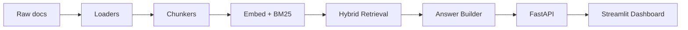

# Biome RAG

Biome RAG is a production-style retrieval-augmented generation pipeline for internal documentation.

## Architecture



## Setup

1. Copy `.env.example` to `.env`.
2. Install dependencies with `pip install -r requirements.txt`.
3. Run ingestion with `python -m biome_rag.ingestion.cli --raw-dir data/raw --processed-dir data/processed --storage-dir data/index`.
4. Start the API with `python app.py`.
5. Start the dashboard with `streamlit run streamlit_app.py`.

## Evaluation

Run the evaluation suite with:

```bash
python -m pytest -q
```

## Results

| Metric | Value |
| --- | --- |
| Correctness | [TODO: fill in from eval report] |
| Faithfulness | [TODO: fill in from eval report] |
| Retrieval relevance | [TODO: fill in from eval report] |
| Citation accuracy | [TODO: fill in from eval report] |
