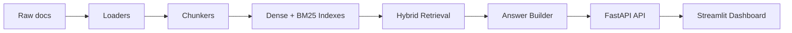

# Biome RAG

Biome RAG is a portfolio-style retrieval-augmented generation system for internal documentation. It combines document ingestion, chunking, hybrid retrieval, grounded answering, citations, and a lightweight dashboard in a single, testable Python project.

## What this project includes

- Multi-format ingestion for markdown, plain text, HTML, and PDF-style documents
- Three chunking strategies: fixed-size, structure-aware, and semantic
- Hybrid retrieval using dense similarity plus sparse BM25 scoring
- Reciprocal Rank Fusion (RRF) and reranking over fused candidates
- Grounded answer generation with citation metadata and confidence scoring
- An evaluation harness with a golden QA set and summary metrics
- A FastAPI service and a Streamlit dashboard for interactive use

## Architecture



## Project structure

- [biome_rag/ingestion](biome_rag/ingestion) — loaders, chunkers, deduplication, and ingestion pipeline
- [biome_rag/retrieval](biome_rag/retrieval) — BM25 persistence, retrieval, reranking, and ranking models
- [biome_rag/generation](biome_rag/generation) — grounded answer generation and confidence scoring
- [biome_rag/evaluation](biome_rag/evaluation) — golden QA data and scoring utilities
- [biome_rag/api](biome_rag/api) — FastAPI app
- [streamlit_app.py](streamlit_app.py) — interactive dashboard

## Quickstart

### Local development

1. Copy [.env.example](.env.example) to `.env` and adjust any values you want to change.
2. Install dependencies:
   ```bash
   pip install -r requirements.txt
   ```
3. Ingest the seed corpus:
   ```bash
   python -m biome_rag.ingestion.cli --raw-dir data/raw --processed-dir data/processed --storage-dir data/index
   ```
4. Start the API:
   ```bash
   python app.py
   ```
5. In a second terminal, start the dashboard:
   ```bash
   streamlit run streamlit_app.py
   ```

The API will be available at `http://localhost:8000` and the dashboard at `http://localhost:8501`.

### Docker

From the project root, run:

```bash
docker compose up --build
```

This starts the API, dashboard, and the local Chroma service so the sample corpus is available without manual setup.

## Configuration

The project uses environment variables for core behavior. The main defaults are defined in [.env.example](.env.example), including:

- `EMBEDDING_MODEL`
- `CHUNK_SIZE`
- `CHUNK_OVERLAP`
- `DEDUP_THRESHOLD`

## Evaluation

The repository includes a golden QA set in [eval/golden_qa.jsonl](eval/golden_qa.jsonl) and metric utilities in [biome_rag/evaluation/metrics.py](biome_rag/evaluation/metrics.py). Run the test suite with:

```bash
python -m pytest -q
```

## Results

The report generation code is ready to be extended for a richer comparison view. The current scaffold includes placeholders for the headline evaluation numbers in [CASE_STUDY.md](CASE_STUDY.md).

## Notes

The sample corpus in [data/raw](data/raw) is synthetic seed data. The ingestion pipeline is designed to work with real documentation as well.
